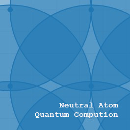
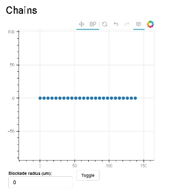
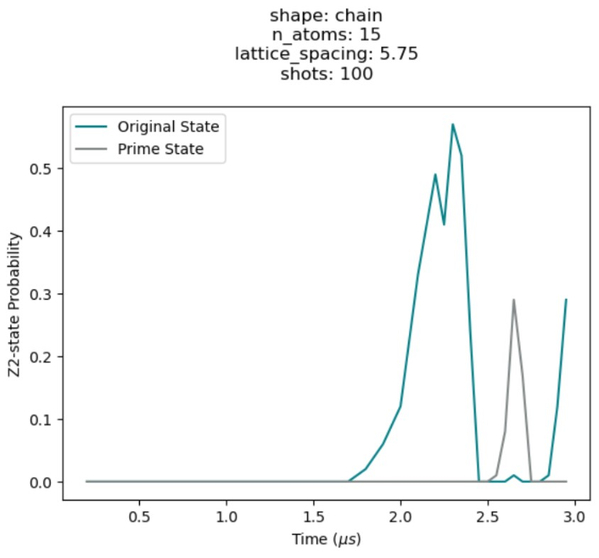
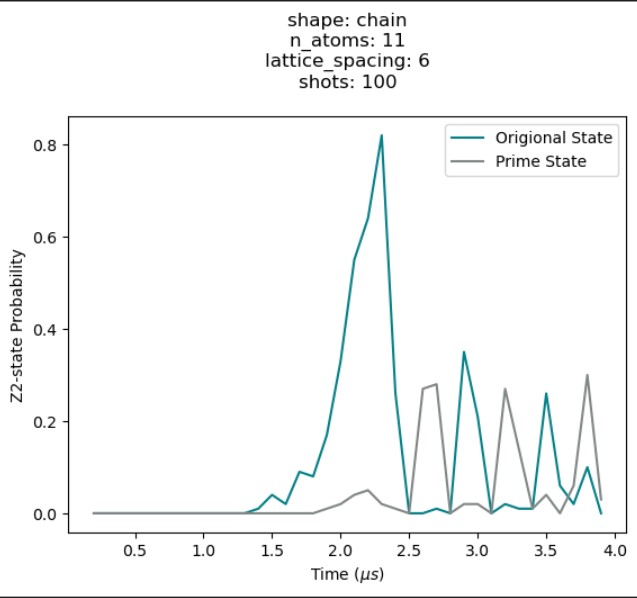
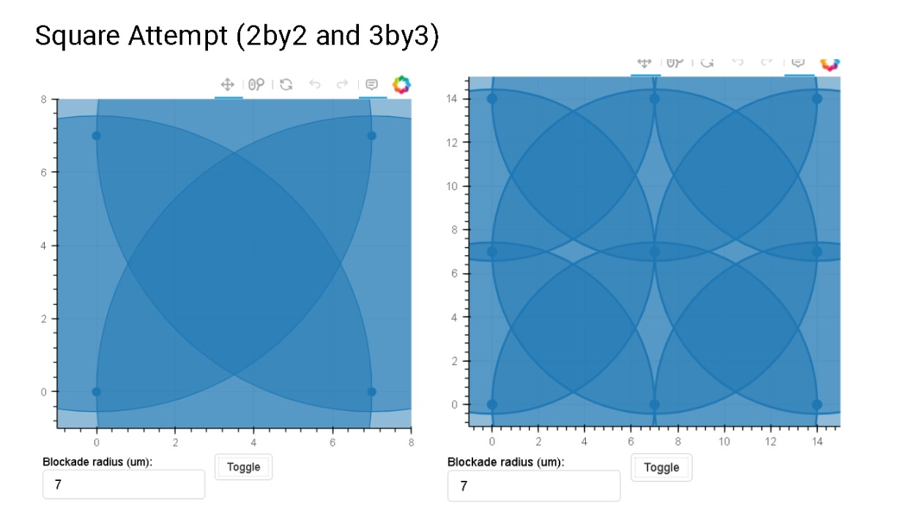
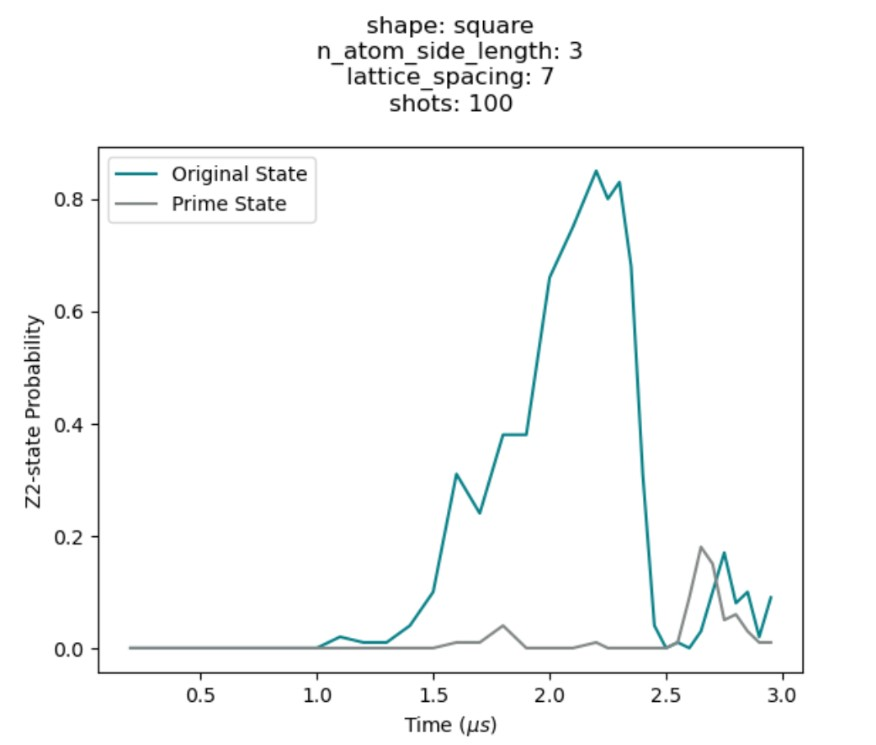
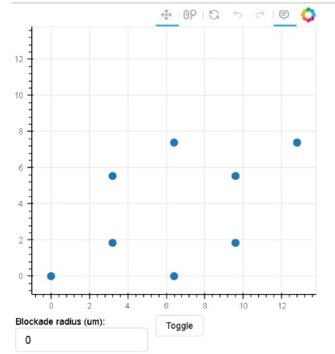

# Learning about Analog Quantum Computing with Neutral Atoms

We set out to learn about the theory behind quantum computation in the Yale Quantum Hackathon 2024. We were in the QuEra track and learned about the phenomenon of scarring.

## How to run the code
1. Clone the repository
2. Install the required packages
```bash
pip install bloqade
```
3. Run the code through each of the the `.ipynb` files. 

these all represent different experiments we took to learn about the phenomenon of scarring and try to replicate it with more atoms and higher probability. 

# What we learned
We tried out 3 different geometric patterns.


## Chain
|  |                                                |
|-------------------------------------|------------------------------------------------|
|      |  |

## Square
|  |  |
|--------------------------------------|------------------------------|


## Hex
|  |  |

We know that the phenomenon with revival is most present with lower number of atoms. For the chain model we were able to replicate the revival phenomenon with 15 atoms. For the square model we were able to replicate the revival phenomenon with 9 atoms with the second peak around 30%. For the hex model we weren't able to replicate the revival phenomenon as easily.


## Future Work
Now that we know about the basic theory in the future we would like to experiment with different geometries with more randomness to see if we can replicate the revival phenomenon with more atoms and higher probability. A lot of the setbacks involved trying to finetune the different parameters to get the revival phenomenon to occur. We would also love to run our code more on the cloud and on Aquila.
